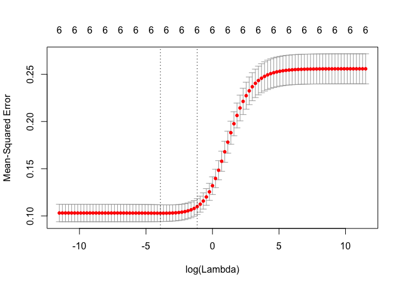
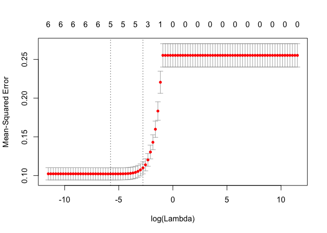
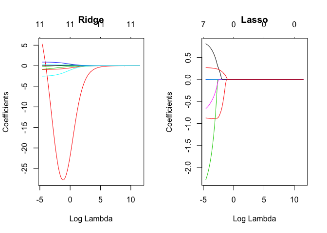
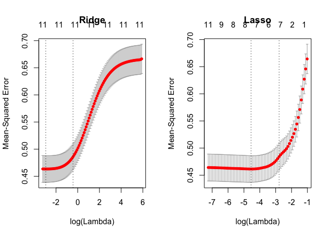

Regularized regression
================
Yue Shi, Ph.D candidate, University of Washington
5/23/2018

-   [Background](#background)
-   [R packages](#r-packages)
-   [Example: What factors affect the insulin levels?](#example-what-factors-affect-the-insulin-levels)
    -   [Apply ridge regression](#apply-ridge-regression)
    -   [Apply lasso regression](#apply-lasso-regression)
    -   [Glmnet note](#glmnet-note)
-   [Example: Wine quality](#example-wine-quality)
    -   [OLS regression](#ols-regression)
    -   [Ridge and lasso regression](#ridge-and-lasso-regression)

``` r
knitr::opts_chunk$set(echo = TRUE, warning=FALSE, message=FALSE)
```

Background
----------

There are three linear regression methods: ordinary least squares (OLS), ridge regression and the lasso. Ridge regression and the lasso are closely related, but only the Lasso has the ability to select predictors. Like OLS, ridge attempts to minimize residual sum of squares of predictors in a given model. However, OLS has a problem: it will keep all the variables. It will tend to overfit the data. When the number of predictors (p) is much less than the sample size (n), plain OLS would yield good results. When there are more variables than the number of samples, (p&gt;&gt;n), OLS will not give unique solutions and the variance of the estimates will become infinite. Therefore, we need more constraints on the number of variables. The regularization techniques often allow reducing the estimate variance at the cost of introducing a slight bias. As a result, the prediction accuracy increases.

Ridge regression includes an additional penalty term- the square of coefficident term, and the impact of this term is controlled by another term, *λ*. When *λ*=0, the OLS coefficients are returned, when *λ* = ∞, coefficients will approach zero.

The cost function of Ridge regression is defined as:
$$
f(\\beta\_0, \\beta\_1, \\cdot\\cdot\\cdot, \\beta\_p)=\\sum\_{i=1}^{n}\[y\_i-(\\beta\_0+\\beta\_1x\_{1i}+\\cdot\\cdot\\cdot+\\beta\_px\_{pi})\]^2+\\lambda\\sum\_{j=1}^p\\beta\_j^2
$$

Note that L2 regularization term (sum of squared *β*) encourages to choose *β* that have small manitude.

The cost function of Lasso regression is defined as:
$$
f(\\beta\_0, \\beta\_1, \\cdot\\cdot\\cdot, \\beta\_p)=\\sum\_{i=1}^{n}\[y\_i-(\\beta\_0+\\beta\_1x\_{1i}+\\cdot\\cdot\\cdot+\\beta\_px\_{pi})\]^2+\\lambda\\sum\_{j=1}^p|\\beta\_j|
$$

Note that L1 regularization term (sum of absolute *β*) encourages many *β* values to be set to zero. L1 regularization will give more extreme *β* values, since it will bring small *β* values to zero and keeps the large values.

So which one you should choose? Ridge or Lasso? Lasso can help feature selection and keep smaller number of variables, and easier to interprete. But there are all very common.

R packages
----------

``` r
library(glmnet)

## Glmnet can do both ridge and lasso regression, you can specify alpha=0 for ridge regression, and alpha=1 for lasso regression. 
## Input: it requires a vector input as respons variables and matrix of predictors. 
## lambda: if not specified, glmnet() will generate default values for you. ALternatively, you can define your own. 
```

Example: What factors affect the insulin levels?
------------------------------------------------

Let's import the data.

``` r
a <- read.table(header = T, file="http://www.cs.washington.edu/homes/suinlee/genome560/data/mice.txt")  

X <- as.matrix(a[,2:7])    # X is sex, weight, length, Triglyceride, Total Cholesterol, FFA
                           # as.matrix is for 
Y <- a[,8]                 # Y is the insulin level
```

### Apply ridge regression

``` r
lambdas=10^seq(5,-5,by=-.1)
ridge.fit=glmnet(x=X, y=Y, alpha=0,lambda=lambdas)
```

`glmnet()` runs the model many times for different values of lambda. How to find the optimal lambda value? What is the criteria? Test error!

In order to get the true test error, you can do cross validation, which partition the data into K equally (or nearly equally) sized segments or folds. Then perform k iterations of training and validation such that each iteration a different fold of the data is held-out for validation while the remaining k-1 folds are used for learning. The true test erros if the average test error of the k-fold iterations. In data mining and machine learning, 10-fold cross-validation (k=10) is the most common. LOOCV is a special case of k-fold cross-validation where k equals the number of samples in the data. The accuracy estimate obtained using LOOCV is known to be almost unbiased. It is widely used when the available data are very rare.

``` r
cv.ridge=cv.glmnet(x=X, y=Y,alpha=0,lambda=lambdas) ##By default, it is 10-fold cross validation.
plot(cv.ridge)
```



The lowest point in the curve indicate the optimal lambda. The dashed line represents the range of lambda values withint one standard error from the minimal lambda value.

``` r
lambda.ridge=cv.ridge$lambda.min
lambda.ridge
```

    ## [1] 0.01995262

What are the coefficients under the optimal lambda?

``` r
ridge.best=glmnet(x=X, y=Y, alpha=0, lambda=lambda.ridge)
coef(ridge.best)
```

    ## 7 x 1 sparse Matrix of class "dgCMatrix"
    ##                        s0
    ## (Intercept)  1.6501583236
    ## sex         -0.2343794360
    ## weight_g     0.0294465278
    ## length_cm    0.0318294631
    ## Trigly       0.0003559087
    ## Total_Chol   0.0001060590
    ## FFA          0.0022748428

What is test error for the model under the optimal lambda?

``` r
min(cv.ridge$cvm) ## cvm: the mean cross-validated error for each lambda value. 
```

    ## [1] 0.1029009

``` r
y.ridge=predict(ridge.best,newx=X)
sum((y.ridge-Y)^2)
```

    ## [1] 32.822

### Apply lasso regression

``` r
cv.ls=cv.glmnet(x=X, y=Y,alpha=1,lambda=lambdas) ##By default, it is 10-fold cross validation.
plot(cv.ls)
```



``` r
lambda.ls=cv.ls$lambda.min
lambda.ls
```

    ## [1] 0.003162278

``` r
lasso.best=glmnet(x=X, y=Y, alpha=1, lambda=lambda.ls)
coef(lasso.best)
```

    ## 7 x 1 sparse Matrix of class "dgCMatrix"
    ##                        s0
    ## (Intercept)  1.880226e+00
    ## sex         -2.285943e-01
    ## weight_g     3.207877e-02
    ## length_cm    .           
    ## Trigly       3.383527e-04
    ## Total_Chol   9.057251e-05
    ## FFA          2.289204e-03

``` r
min(cv.ridge$cvm) ## cvm: the mean cross-validated error for each lambda value. 
```

    ## [1] 0.1029009

``` r
y.ls=predict(lasso.best,newx=X)
sum((y.ls-Y)^2)
```

    ## [1] 32.77248

### Glmnet note

Please note that the textbook uses penalized least squares (sum of squred error), but glmnet uses penalized mean squared error. Also glmnet standardizes the input data, both predictors and response are normalized and centered before performing the regression. Still, the result is always given in the original data scale.

Example: Wine quality
---------------------

[The Wine Quality data set](http://archive.ics.uci.edu/ml/machine-learning-databases/wine-quality/) describes red and white variants of the “Vinho Verde” wine from the Minho province in the north of Portugal. In this work, we only analyze the red wine data. The predictors are various physicochemical parameters such as density, acidity, the amount of sugar and alcohol. The response is the wine quality score between 0 and 10. We are going to build regression models that describe how the wine quality score depends on the physicochemical characteristics of the wine using OLS, Ridge and LASSO.

Load the data.

``` r
wine=read.csv2("winequality-red.csv", na.strings="N/A", dec=".")
names(wine)
```

    ##  [1] "fixed.acidity"        "volatile.acidity"     "citric.acid"         
    ##  [4] "residual.sugar"       "chlorides"            "free.sulfur.dioxide" 
    ##  [7] "total.sulfur.dioxide" "density"              "pH"                  
    ## [10] "sulphates"            "alcohol"              "quality"

``` r
dim(wine)
```

    ## [1] 1599   12

Divide the data into training set and test set.

``` r
x=names(wine)[1:length(names(wine))-1]
X=wine[,x]
Y=wine$quality

set.seed(1) ## set.seed command with a fixed input value of 1 is used to get results that can later be reproduced by the reader. 
train=sample(1:nrow(X),nrow(X)/2) ## subset the data into halves. 
test=(-train)

x.train=model.matrix(~.,X[train,])[,-1]
y.train=Y[train]
x.test=model.matrix(~.,X[test,])[,-1]
y.test=Y[test]
```

### OLS regression

``` r
ols=lm(y.train~.,data=data.frame(x.train))
summary(ols)$r.squared
```

    ## [1] 0.3334006

``` r
summary(ols)$coefficients
```

    ##                          Estimate   Std. Error    t value     Pr(>|t|)
    ## (Intercept)          -8.915263647 29.682164449 -0.3003576 7.639837e-01
    ## fixed.acidity        -0.012694180  0.036141141 -0.3512390 7.255030e-01
    ## volatile.acidity     -0.942219416  0.177453609 -5.3096661 1.430026e-07
    ## citric.acid          -0.164051975  0.221544356 -0.7404927 4.592220e-01
    ## residual.sugar       -0.005071207  0.020817686 -0.2436009 8.076034e-01
    ## chlorides            -2.598680145  0.607023014 -4.2810241 2.089921e-05
    ## free.sulfur.dioxide   0.007202173  0.003171843  2.2706586 2.343711e-02
    ## total.sulfur.dioxide -0.004175447  0.001096891 -3.8066186 1.518236e-04
    ## density              14.972985897 30.292035109  0.4942879 6.212408e-01
    ## pH                   -0.928860905  0.276751587 -3.3562984 8.278251e-04
    ## sulphates             0.892644025  0.169697359  5.2602116 1.856257e-07
    ## alcohol               0.293582123  0.037518691  7.8249564 1.635827e-14

### Ridge and lasso regression

``` r
lambdas=10^seq(5,-2,length=100)
ridge=glmnet(x=x.train, y=y.train,alpha=0,lambda=lambdas)
lasso=glmnet(x=x.train, y=y.train,alpha=1,lambda=lambdas)
par(mfrow=c(1,2))
plot(ridge, xvar="lambda", main="Ridge")
plot(lasso, xvar="lambda", main="Lasso")
```



This plot shows the number of none-zero coefficients for a given value of *l**o**g**λ*. One can see that, as *λ* increases, the coefficients are shurnk towards zero. Lasso regression more rigorously select predictor variables.

Let's select the *λ* value using the cross-validation procedure.

``` r
set.seed(1)
ridge.cv=cv.glmnet(x=x.train, y=y.train, alpha=0)
set.seed(1)
lasso.cv=cv.glmnet(x=x.train, y=y.train, alpha=1)
par(mfrow=c(1,2))
plot(ridge.cv,main="Ridge")
plot(lasso.cv,main="Lasso")
```



``` r
ridge.bestlam=ridge.cv$lambda.min
lasso.bestlam=lasso.cv$lambda.min
ridge.bestlam
```

    ## [1] 0.05257397

``` r
lasso.bestlam
```

    ## [1] 0.01056334

Get thecoefficients under the best lambda value.

``` r
ridge.best=glmnet(x=x.train,y=y.train,alpha=0, lambda=ridge.bestlam)
coef(ridge.best)
```

    ## 12 x 1 sparse Matrix of class "dgCMatrix"
    ##                                 s0
    ## (Intercept)           18.609546361
    ## fixed.acidity          0.015201423
    ## volatile.acidity      -0.876013497
    ## citric.acid           -0.053485292
    ## residual.sugar         0.006125110
    ## chlorides             -2.363657886
    ## free.sulfur.dioxide    0.005467467
    ## total.sulfur.dioxide  -0.003616858
    ## density              -13.483894599
    ## pH                    -0.638202504
    ## sulphates              0.857646847
    ## alcohol                0.250928240

``` r
lasso.best=glmnet(x=x.train,y=y.train,alpha=1, lambda=lasso.bestlam)
coef(lasso.best)
```

    ## 12 x 1 sparse Matrix of class "dgCMatrix"
    ##                                s0
    ## (Intercept)           5.178557833
    ## fixed.acidity         .          
    ## volatile.acidity     -0.874017904
    ## citric.acid           .          
    ## residual.sugar        .          
    ## chlorides            -2.263544618
    ## free.sulfur.dioxide   0.003981222
    ## total.sulfur.dioxide -0.003170430
    ## density               .          
    ## pH                   -0.656620202
    ## sulphates             0.812199596
    ## alcohol               0.270318877

Let's calculate the RSS (residule sum of squares)

``` r
y.lm.train=predict(ols, newdata=data.frame(x.train))
sum((y.lm.train-y.train)^2)
```

    ## [1] 354.7427

``` r
y.lm.test=predict(ols, newdata=data.frame(x.test))
sum((y.lm.test-y.test)^2)
```

    ## [1] 318.1009

``` r
y.ridge.train=predict(ridge.best, newx=x.train)
sum((y.ridge.train-y.train)^2)
```

    ## [1] 355.846

``` r
y.ridge.test=predict(ridge.best,newx=x.test)
sum((y.ridge.test-y.test)^2)
```

    ## [1] 316.3684

``` r
y.lasso.train=predict(lasso.best, newx=x.train)
sum((y.lasso.train-y.train)^2)
```

    ## [1] 356.2117

``` r
y.lasso.test=predict(lasso.best,newx=x.test)
sum((y.lasso.test-y.test)^2)
```

    ## [1] 315.7833

Here the smallest RSS value on the train set is predictably achieved by the OLS regression since unlike Ridge and LASSO the OLS does not impose penalties on the coefficients bi. It is interesting that the errors on the test set are ordered differently - the minimum is achieved by LASSO at λ = lasso.bestlam, the second is Ridge at λ = ridge.bestlam while OLS takes only the third position. In this case, Ridge and LASSO perform better than OLS on the test set.

So the question is which regression method you should choose and believe? When you calculate the true error, it is cheating to use the training data, because you get the best lambda from the training data based on the RSS and you can not infer RSS from the training set. That's why you need test data, where you can get the true test error.
